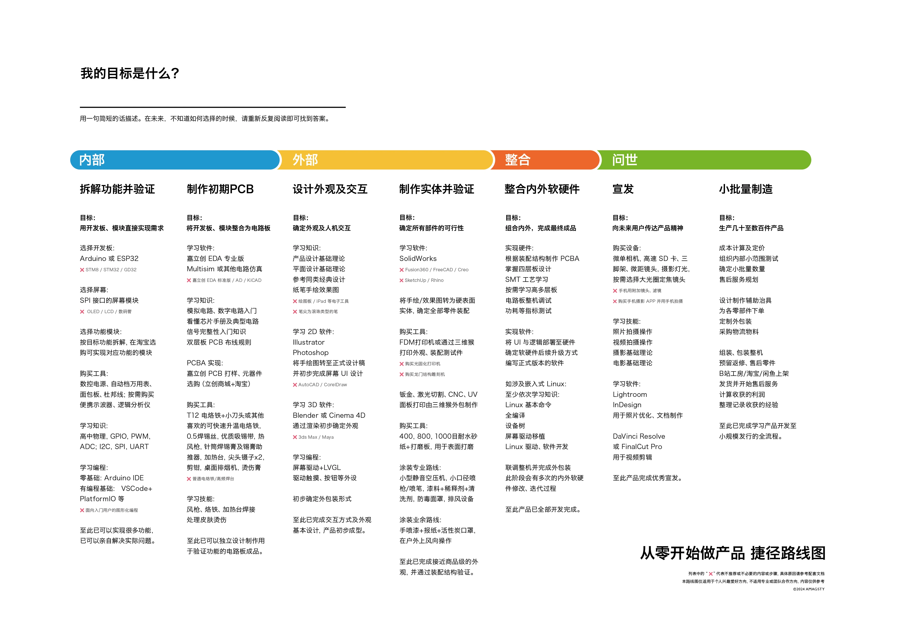

# 从零到产品：捷径路线图

面向个人创作者，不是专业团队流水线。原图：

## 四段 × 七步

| 段 | 步骤 | 目标 | 与本仓库的关系 |
|---|---|---|---|
| **内部** | 1. 拆解功能并验证 | 开发板 + 模块快速实现需求 | [Starter Kit](starter-kit.md) + [六关](learning-path.md) |
| **内部** | 2. 制作初期 PCB | 把已验证的模块收成一块板 | [PCB / PCBA](manufacturing-jlc.md) |
| **外部** | 3. 设计外观及交互 | 确定屏幕、按键、声音和外观 | [工具地图](tools.md) |
| **外部** | 4. 制作实体并验证 | 结构可装、可打印、可维护 | [3D 打印](manufacturing-jlc.md#d-嘉立创-3d-打印) |
| **整合** | 5. 整合内外软硬件 | PCBA 装进壳，验证电、热、无线与续航 | [安全规则](safety.md) |
| **问世** | 6. 文档与展示 | Demo、照片、说明书、源码和 BOM | [案例库](resources.md#21-可复现案例库) |
| **问世** | 7. 小批量制造 | 10–100+ 台，建立测试与售后 | [试产、成本、测试与售后](product-course.md#small-batch) |

## 配套实操教程

[从原型到产品](product-course.md)补充原图的缺少项：

- [需求拆解](product-course.md#requirements)：需求、模块 BOM 与验证。
- [电路进阶](product-course.md#electronics)：手册、模拟电路、信号与返修。
- [外观交互](product-course.md#interaction)：草图、界面、LVGL 与效果图。
- [实体加工](product-course.md#enclosure)：尺寸示例、试装、后处理与其他工艺。
- [整机联调](product-course.md#integration)：功耗、OTA 与 Linux 选修。
- [宣发](product-course.md#launch)：摄影、剪辑、产品页与素材清单。
- [小批量](product-course.md#small-batch)：试产、治具、成本、包装与售后。

这些是教学步骤和练习材料，不代表已经完成对应实物或生产验收。原图的软件名称以同类工具覆盖，不要求每款软件分别学习。

## 每一步怎么写、怎么验

| 步骤 | 先回答 | 默认工具 | 必须留下 | 通过条件 |
|---|---|---|---|---|
| 1. 功能验证 | 一个输入、一个判断、一个输出是什么？ | ESP32-S3、Arduino / PlatformIO | 接线图、固件、串口日志、模块 BOM | 实物连续运行，输入与输出可重复 |
| 2. 初期 PCB | 哪些模块已稳定，哪些仍要插拔？ | 嘉立创 EDA / KiCad | 原理图、PCB 源文件、Gerber、BOM、CPL | ERC/DRC 通过，Gerber 与贴装方向人工复核 |
| 3. 外观交互 | 用户何时看、按、听、充电和维修？ | Figma / LVGL | 状态图、界面稿、接口位置与尺寸 | 所有状态有入口、反馈、失败和退出路径 |
| 4. 实体结构 | 板、电池、喇叭、线束如何装进去？ | Fusion / build123d / Onshape | STEP、STL、尺寸表、材料与公差 | 数字装配无干涉，打印件完成实物试装 |
| 5. 整机联调 | 峰值电流、温升、无线、续航是否达标？ | 万用表、可调电源、日志 | 联调记录、校准值、故障清单 | 长时间运行和异常恢复达到项目标准 |
| 6. 文档展示 | 别人能否按资料复现？ | GitHub、照片、视频 | README、BOM、组装、烧录、演示 | 新的人能在不口头求助下完成核心链路 |
| 7. 小批量 | 每一台如何测试、编号和返修？ | 治具、标签、库存表 | 生产 BOM、测试 SOP、版本与售后策略 | 抽检、全检、包装和成本达到目标 |

每一步只在通过当前实物关卡后进入下一步。AI 生成、代码编译、Gerber 导出、切片完成和报价页打开，分别只是数字阶段完成，不是实物验收。

## 捷径原则（图中的 ×）

- 入门优先 **Arduino / ESP32**，不必一上来 STM32
- 能买模块就先买模块，先验证体验再画板
- 红色叉号多半是「可跳过 / 对个人过重」的路径，不是绝对禁止

## 和 Naval / Vibe 的对齐

生成要快，但每步仍要**实物验收**：编译过、接通过、点亮过、打印过、对得上尺寸。人做 Verifier。见 [philosophy.md](philosophy.md)。
